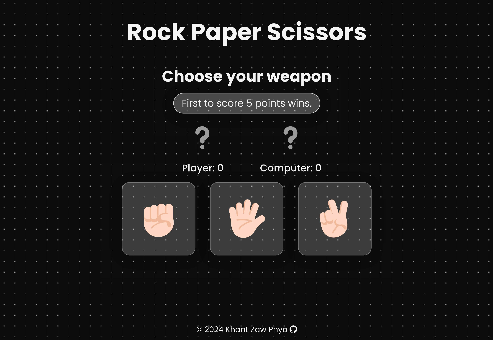

# odin_rps



This is a Rock-Paper-Scissors game created as part of The Odin Project curriculum. The game allows users to play against the computer in a classic Rock-Paper-Scissors match.

## Live Demo

You can play the game [here](https://khantzawphyo.github.io/odin_rps/).

## Features

- Responsive design
- Interactive UI with animated buttons
- Displays current score and messages
- Modal for game messages and restart button

## Technologies Used

- HTML
- CSS
- Vanilla JavaScript

## Setup

To run this project locally, follow these steps:

1. Clone the repository:
   ```
   git clone https://github.com/khantzawphyo/odin_rps.git
   ```
2. Navigate to the project directory:
   ```
   cd odin_rps
   ```
3. Open `index.html` in your preferred web browser.

## Contributing

Contributions are welcome! Please fork the repository and create a pull request with your changes.

## Acknowledgments

- The Odin Project for the curriculum and guidance.
- Inspiration from various Rock-Paper-Scissors games found online.
